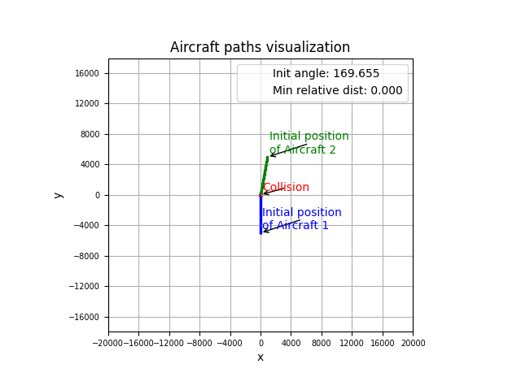
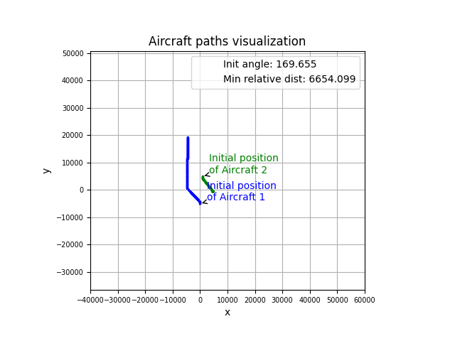

# Generated test results

This directory contains a structured collection of directories representing 10 distinct tests. Each test represent a unique scenario where the collision avoidance system is evaluated using generated parameters.

First 6 tests are consistent probing specified situations:
1. Aircraft following another aircraft and catching up
2. Aircraft flying head-on towards each other with same speed
3. Aircraft flying towards each other with different speed
4. Aircraft following another aircraft and catching up with slight angle
5. Aircraft flying head-on towards each other with same speed and slight angle
6. Aircraft flying towards each other with different speed and slight angle

The last 4 tests are randomly selected situations - angle between aircrafts are decimals between 0-180.

## Test Iterations

- The first image in each test iteration captures the scenario with collision avoidance turned off.
- The second image in each test iteration depicts the same scenario with collision avoidance enabled.

These images serve as a visual comparison to assess the effectiveness of the collision avoidance system under various conditions. Collision is defined as the paths intersecting without further path after.

## Directory Structure

The simulation directories are named sequentially through simulation id 0-9 `simulation-[simulation-id]-[test_id]-[simulation_hash]` and are enclosed by the date directory. Inside each of these directories, you will find:

## Example

